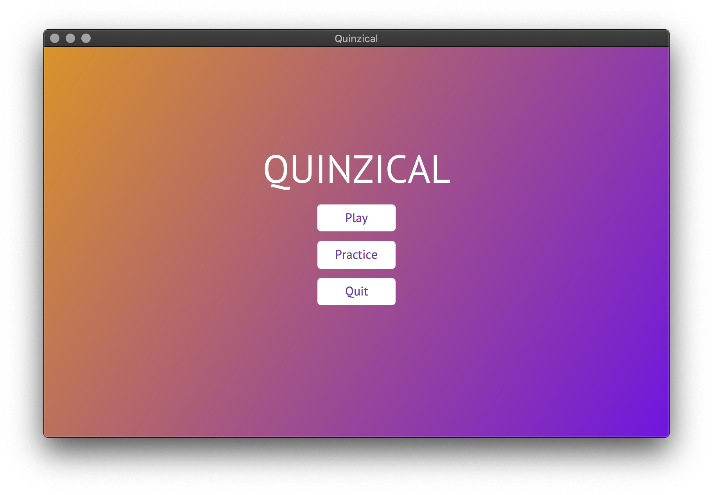
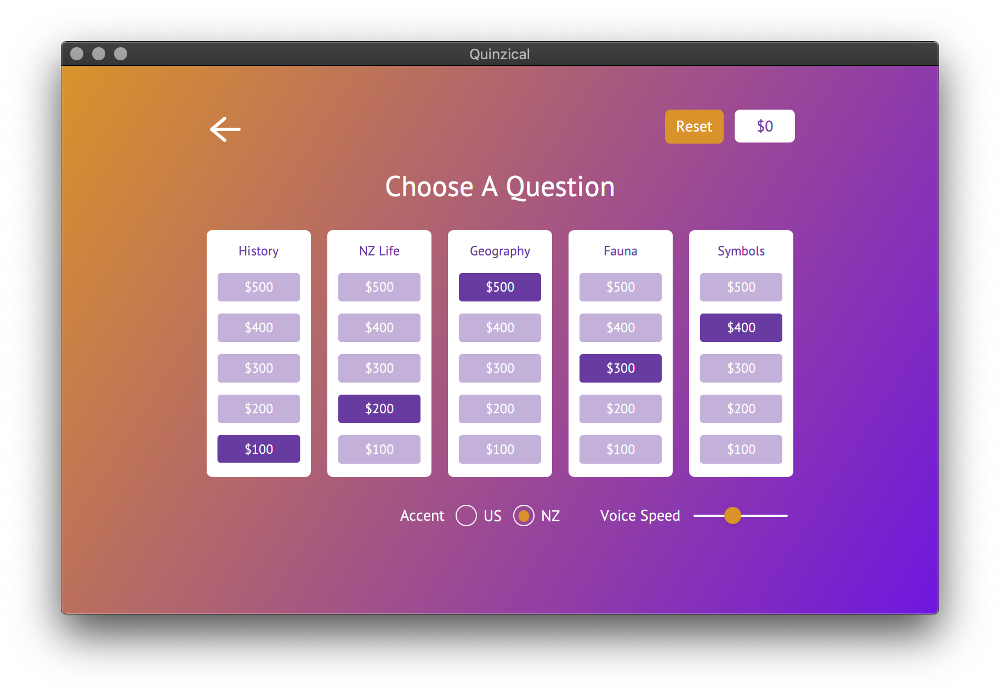
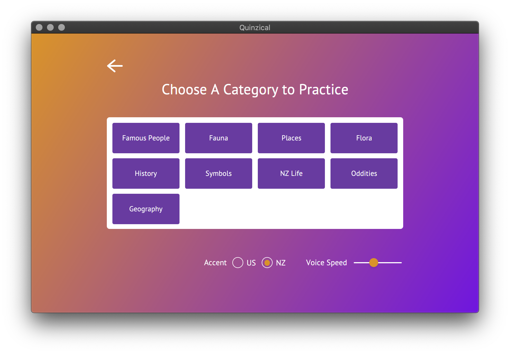
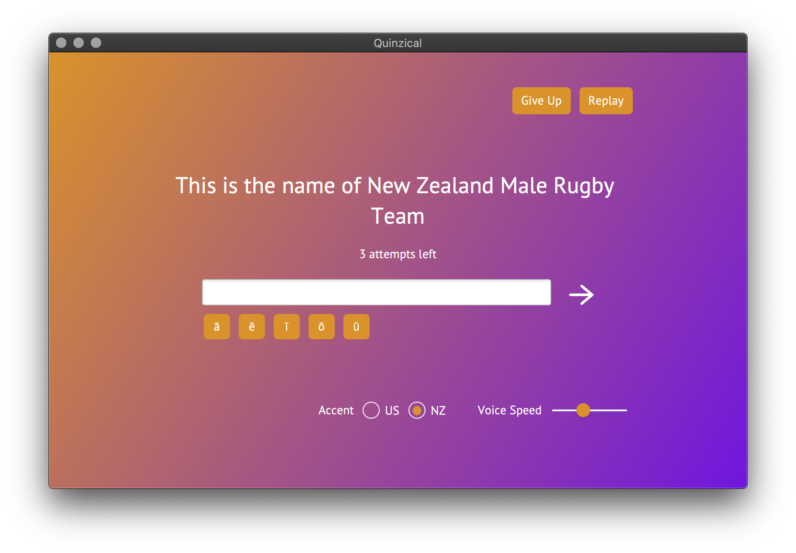

# Welcome to Quinzical!

### A note for the markers
Some methods in the controllers might be greyed out which would normally signify unused methods. These methods, however, are used. Because the controllers are set within the code and not within the .fxml files, it appears that they are not used when they actually are. The same applies for the "errors" within the .fxml files. When the controller is set, the code will work.

Everything is packaged already in the submission so all you need to do is unzip the file, set excutable permissions to Quinzical.jar, and run it
```
> chmod +x Quinzical.jar
> java -jar Quinzical.jar
```

## How to Play
If you've always wanted to learn more about New Zealand, here's your chance. The game is very easy to play!

You will be presented with a start up screen where you can either choose to play the real game, or practice some of the questions from each category. 

In the 'Play' section, you will be presented with 5 randomly chosen categories with question values underneath them. You will only be able to play the lowest value that hasn't been answered in each category, but you won't know what the question is! Select one of them and you'll be in to win that much money!

In the 'Practice' section, you will be presented with all the possible categories. Simply click one and a randomly chosen question from that category will be asked. You will be given 3 attempts the answer the question - on your third attempt, the first letter of the answer is given. Don't worry about getting it wrong! The questions aren't worth anything, they're simply there for you to practice.

When you've completed all the questions in the 'Play' section, enter a name to save your score and the game wil reset. A new set of questions will be generated for you to play again!

You can also add your own questions! 
[Read below to find out how](#adding-categories-and-questions)

## Screenshots
<div>
  
  
  
  
</div>

## Requirements
- You must have a [Java Runtime Environment (JRE)](https://www.oracle.com/java/technologies/javase-jre8-downloads.html) installed on your system
- If you encounter a JNI error, try installing the [Java11 JDK](https://www.oracle.com/java/technologies/javase-jdk11-downloads.html) for your system

## Download
##### Note: It is very important that you have at least 5 categories with at least 5 questions in each

### Linux
1. [Download](https://github.com/SOFTENG206-2020/assignment-3-and-project-team-34/raw/master/Quinzical.jar) the Quinzical.jar file
2. [Download](https://github.com/SOFTENG206-2020/assignment-3-and-project-team-34/raw/master/categories.zip) the categories.zip file
   - Alternatively, you can create your own categories and questions. [See below for how to do this](#adding-categories-and-questions)
   - Unpack the .zip and move the 'categories' folder into the same directory as Quinzical.jar
4. Open the terminal and execute the following commands
   ```
   > cd "path/to/jar"
   > chmod +x Quinzical.jar
   > java -jar Quinzical.jar
   ```

## Adding Categories And Questions
You may add your own categories and questions as long you follow the correct format.
- The category file must be a plain text file
- It must be located within the 'categories' folder
- The 'categories' folder must be in the same directory that the .jar file is in
- You may not change the name of the 'categories' folder however, you can name the category file whatever you like
- Each question within a category must be separated by a new line
- Within each question, the format is as follows:
  - question(what/who/where is)answer
    - So, the line must start with the question, followed by a a bracketed (who is), (what is), etc. depending on the question, then the answer
  - One example might be: *This New Zealander was the first person to climb Mount Everest(Who is)Edmund Hillary*
