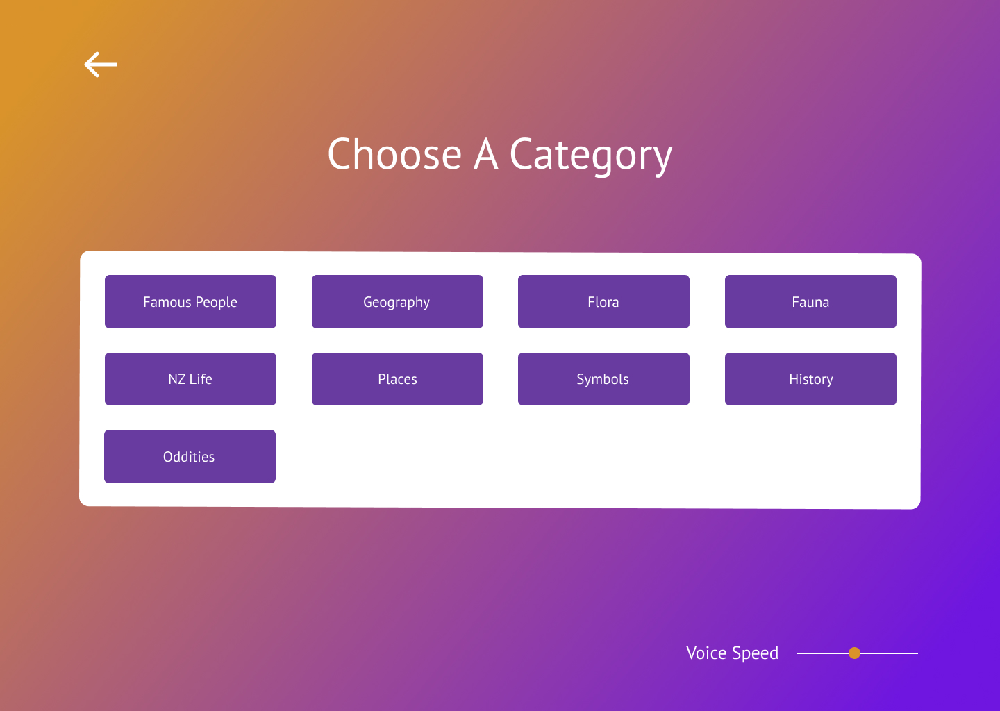
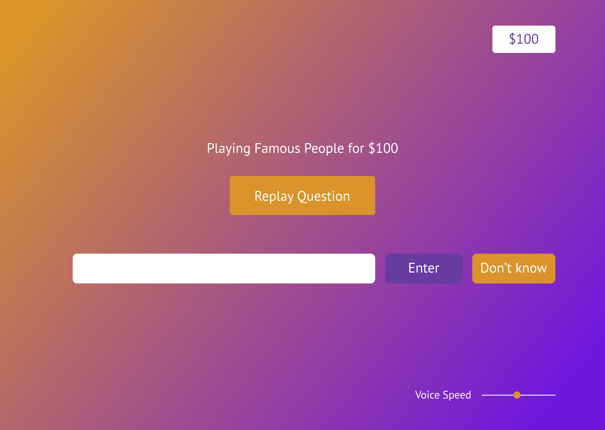
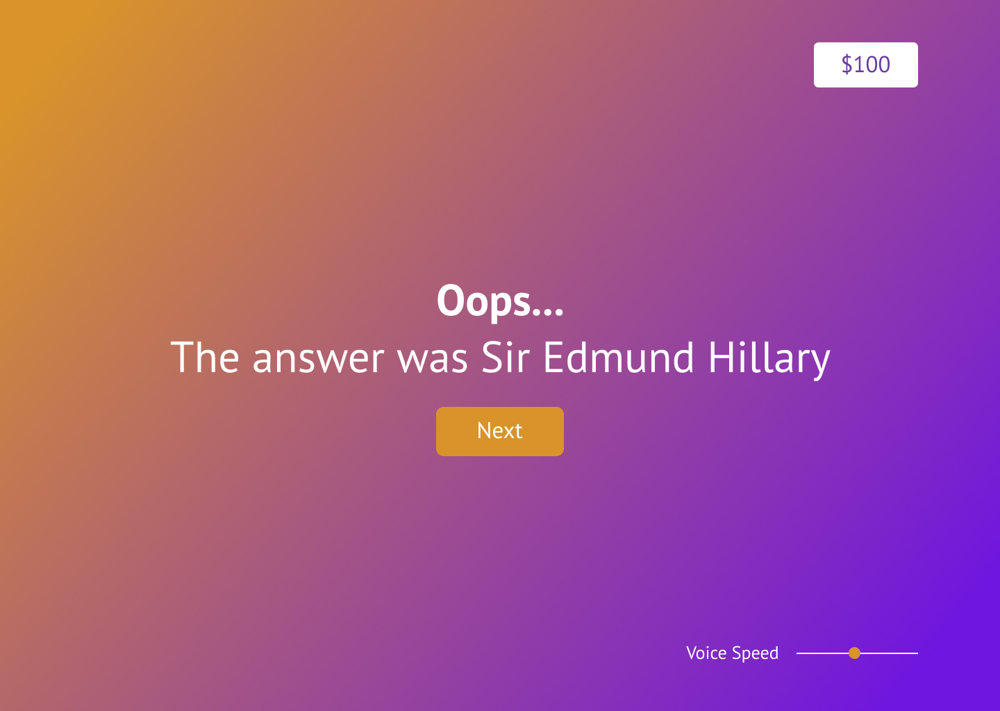
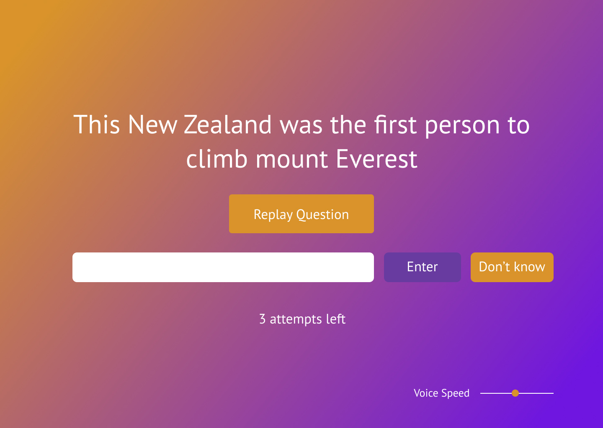

# Design
This is where we are documenting our design process when developing the Quinzical game. In here, we will be discussing
both [UI](#ui) and [UX](#ux), covering:
- [Colour](#color)
- [Layout](#layout)
- [Typography](#typography)
- [Navigation](#navigation)

## UI
### Colour
#### Colour Scheme

This was the first decision that had to be made to form the base of our design. The main requirements were:
- Colours must complement each other well
- Colours had to high contrast so maintain readability and accessibility
- Use no more than 5 different colours (to keep things clean and easy on the eye)

We started off with some research:

<link rel="stylesheet" type="text/css" media="all" href="./style.css" />

    
    
    
    

 

A main theme that we noticed in these popular game-show/quiz type platforms is the use of purple and bright/bold colours.
So we decided to take inspiration by using purple and complementing it with a brighter and contrasting colour, orange.

**Sample scenes:**

    
    
    

 

    
    
    

#### Accessibility

### Layout

### Typography

## UX
### Navigation