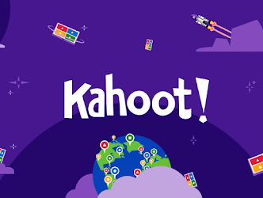
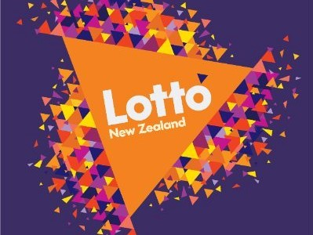
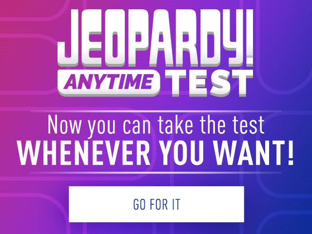
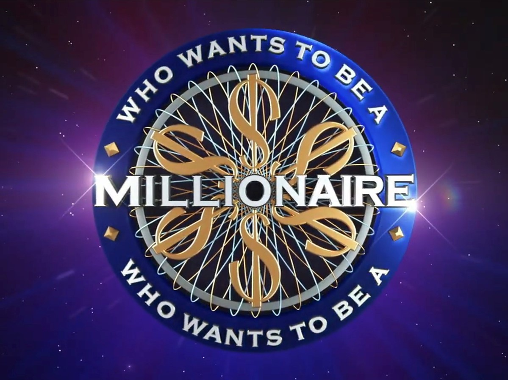
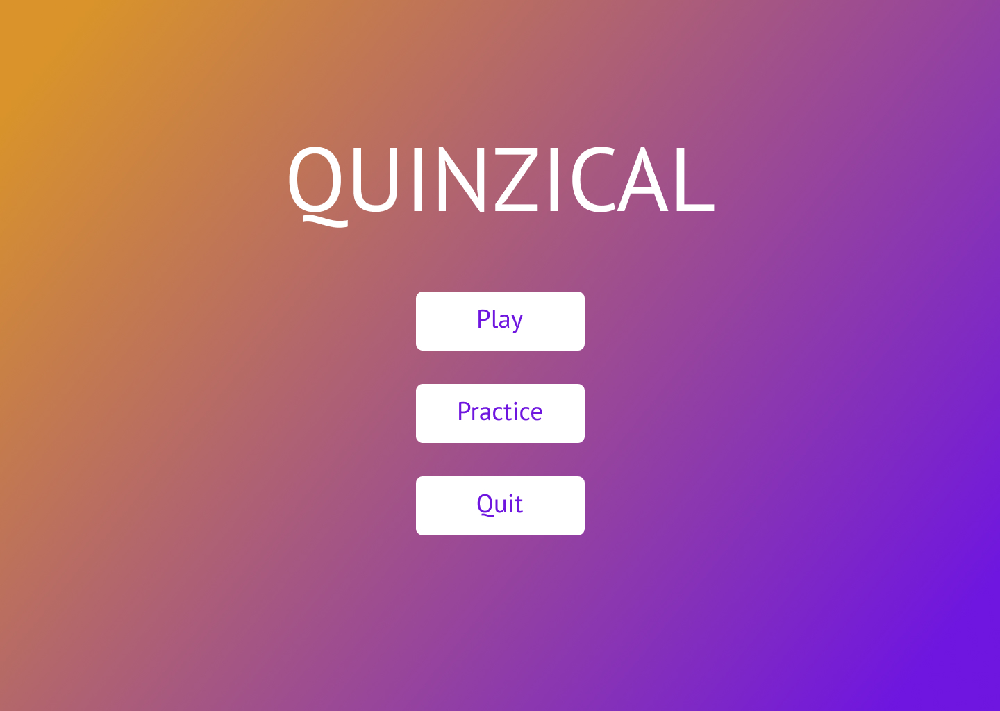
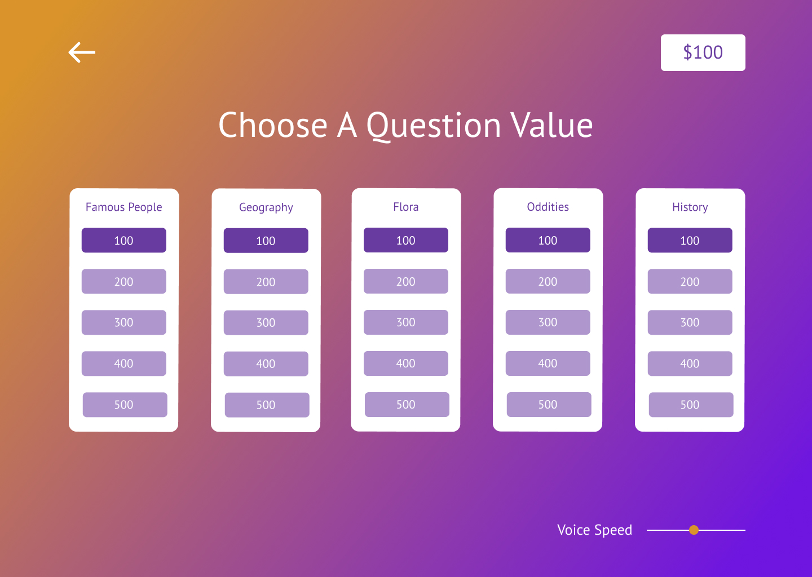
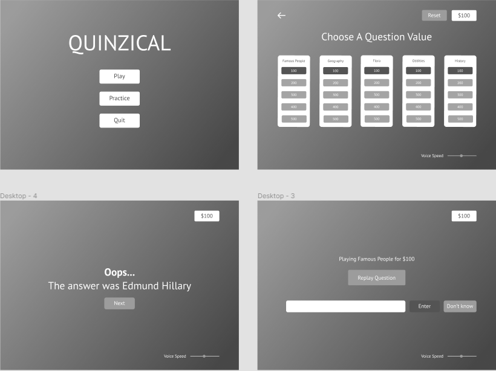
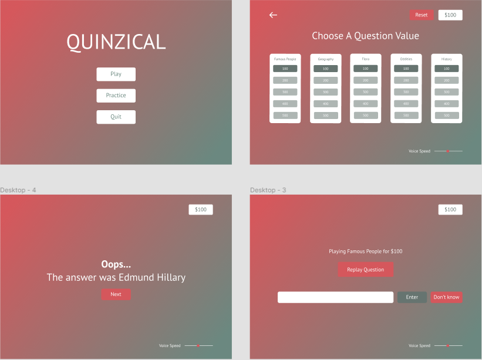

# Design
This is where we are documenting our design process when developing the Quinzical game. In here, we will be discussing
both [UI](#ui) and [UX](#ux), covering:
- [Colour](#color)
- [Layout](#layout)
- [Typography](#typography)
- [Navigation](#navigation)

## UI
### Colour
#### Colour Scheme

This was the first decision that had to be made to form the base of our design. The main requirements were:
- Colours must complement each other well
- Colours had to high contrast so maintain readability and accessibility
- Use no more than 5 different colours (to keep things clean and easy on the eye)

We started off with some research:

    
    
    
    

 

A main theme that we noticed in these popular game-show/quiz type platforms is the use of purple and bright/bold colours.
So we decided to take inspiration by using purple and complementing it with a brighter and contrasting colour, orange.

#### Sample scenes

    
    
    

 

Upon mouse-over on the buttons, the cursor turns into a hand so that the user knows that it is clickable. Text colour is chosen such that
it provides enough contrast in the background for it to be readable.

#### Accessibility
Accessibility is very important for those who are visually impaired. For this, we used the Chrome extension, 
[Colorblindly](https://chrome.google.com/webstore/detail/colorblindly/floniaahmccleoclneebhhmnjgdfijgg?hl=en), to ensure that
all elements of the Quinzical are able to be read and distinguished.

  
  
  
  
<b>Left to right</b>: Achromatopsia (Monochrome), Tritanopia (Blue-Blind)

### Layout

### Typography

## UX
### Navigation